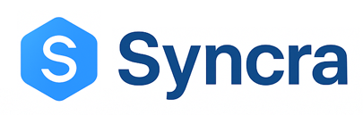

<p align="center">
  
  <p align="center"><i>AI-Powered Resume Matcher</i></p>
  <p align="center"><i>Elegant, Explainable, and Entirely Local.</i></p>
</p>
<p align="center">
  <a href="https://streamlit.io/">
    
  </a>
  <a href="https://ollama.ai/">
    
  </a>
  <a href="https://opensource.org/licenses/MIT">
    
  </a>
</p>

---

## 🚀 **Overview**

**Syncra** helps recruiters and hiring managers intelligently match candidate resumes against job descriptions using fully **local AI models** — no cloud, no data leaks, just insights.

**Syncra** is an interactive resume matching platform built using  
💻 **Streamlit** (frontend) + 🐍 **Python backend** + 🧩 **Ollama local LLMs**.

It compares job descriptions with multiple candidate resumes, assigns a **match score (1–10)**, and provides **human-readable reasoning** for each match — powered by your choice of **local LLM** and **embedding model**.

---

## ✨ **Key Features**

### 🧩 **AI-Powered Matching**
- Supports **local LLMs** via [Ollama](https://ollama.com) (e.g. `mistral`, `llama`, `phi`, `qwen`, etc.)
- Generates contextual reasoning for each resume → **why it fits / doesn’t fit**
- Uses **semantic embeddings** to calculate similarity between job and resume text

---

### 🧠 **Flexible Embedding Engines**
- Choose between:
  - 🧠 **Ollama-based Embeddings**
  - 🧩 **MiniLM (Local Transformer)** — lightweight, fast, and accurate  
- Easy dropdown switch — no configuration required

---

### 🗂️ **Multi-Resume Comparison**
- Upload a single Job Description (PDF)
- Upload multiple Candidate Resumes (PDFs)
- Instantly view all results in one unified dashboard

---

### 📊 **Interactive Results Dashboard**
- Color-coded **Score Indicators**:
  - 🔴 Low (1–4.9)
  - 🟡 Medium (5–7.9)
  - 🟢 High (8–10)
- FIT / NOTFIT badges based on threshold
- Collapsible **Reasoning** column for detailed explanations
- Clickable column headers for **live sorting**
- Download results as **CSV**

---

### ⚙️ **Performance & Caching**
- ⚡ Built-in **DiskCache layer** for embeddings & LLM reasoning
- View cache size and entries in sidebar  
- One-click **“Clear Cache”** option  
- Sidebar shows **live cache summary**

---

### 🧭 **User Interface Highlights**
- 🪶 Uses **OUTFIT font** and modern color palette
- 💙 Responsive dark theme matching logo hues
- 🧠 Dynamic model indicator (color changes by LLM)
- 🎯 Smooth local performance — **no internet calls**

---

## 🧩 **Tech Stack**

| Layer | Technology |
|-------|-------------|
| Frontend | [Streamlit](https://streamlit.io) |
| Backend | Python 3.12 |
| LLM Engine | [Ollama](https://ollama.com) (local models like `mistral:7b`, `llama3`, etc.) |
| Embeddings | Ollama / Sentence Transformers |
| Cache | [DiskCache](https://grantjenks.com/docs/diskcache/) |
| Styling | Custom `theme.css` |
| JS Logic | Modular `script.js` for interactivity |

---

## ⚙️ **Installation & Setup**

### 1️⃣ Clone the repository
```bash
git clone https://github.com/yourusername/syncra.git
cd syncra
```

### 2️⃣ Create a virtual environment (using uv)
```bash
uv venv
uv pip install -r requirements.txt
```

### 3️⃣ Run Ollama locally
Make sure Ollama is installed and running:
```bash
ollama run mistral
```

### 4️⃣ Launch the app
```bash
streamlit run app.py
```

### 📦 Project Structure
```bash
syncra/
│
├── app.py               # Main Streamlit frontend + logic
├── utils.py             # Helper functions for embeddings, cache, similarity
├── theme.css            # Styling and theming (OUTFIT-based)
├── script.js            # Sorting, collapsible reasoning, and DOM handling
├── syncra_logo_01.png   # App logo
├── requirements.txt     # Python dependencies
└── README.md            # This file 🙂
```

### 💡 Usage Flow
1️⃣ Upload Job Description (PDF)

2️⃣ Upload Candidate Resumes (PDFs)

3️⃣ Select your preferred LLM and Embedding model

4️⃣ Click “Analyze Matches”

5️⃣ Review interactive results table with:
  - 🟩 Scores
  - 🎯 FIT/NOTFIT badges
  - 🧠 Explainable reasoning

6️⃣ Export results as CSV if needed.


### 🔒 Privacy First
All data is processed entirely on your local machine.
No uploads, no APIs, no data sharing.
Your resumes and job descriptions never leave your environment.

### 🧭 Future Enhancements
    🧮 Weighted multi-factor scoring (skills, experience, education)
    📁 Batch JD vs. Resumes processing
    📊 Skill-wise radar visualization
    🔄 Resume rewriting suggestions via LLM
    🌐 Multi-language support

## 💬 **Acknowledgments**
- [Streamlit](https://streamlit.io) 🧱 — for providing a simple yet powerful way to build interactive web apps in Python.  
- [Ollama](https://ollama.com) 🤖 — for enabling fully local LLM hosting and inference with models like `mistral`, `llama`, and `phi`.  
- [Sentence Transformers](https://www.sbert.net) 🧠 — for efficient semantic embeddings that make text similarity meaningful.  
- [DiskCache](https://grantjenks.com/docs/diskcache/) ⚡ — for ultra-fast local caching and performance optimization.  
- [Outfit Font](https://fonts.google.com/specimen/Outfit) ✨ — for a modern and elegant visual identity.  

> A heartfelt thanks to the open-source community for empowering developers to create explainable, privacy-first AI tools like **Syncra**.

## 🧑‍💻 **Author**

**Pranoliver**  
*Chief Architect & Software Engineer*  

💼 Building elegant, explainable, and efficient AI systems.  
📧 [Contact](mailto:pranoliver@gmail.com) | 🌐 [GitHub](https://github.com/pranoliver)

## ⚖️ **License**

This project is licensed under the **MIT License** — see the [LICENSE](LICENSE) file for details.

---

### 📜 MIT License (Summary)

You are free to:

- ✅ **Use** the code for personal and commercial projects  
- 🛠️ **Modify** and adapt it to your needs  
- 📤 **Distribute** copies with proper attribution  

**Under the following conditions:**
- You must include the original copyright notice.
- The software is provided *“as is”*, without warranty of any kind.

> In short — use it, improve it, share it, but please give credit to the original author.
